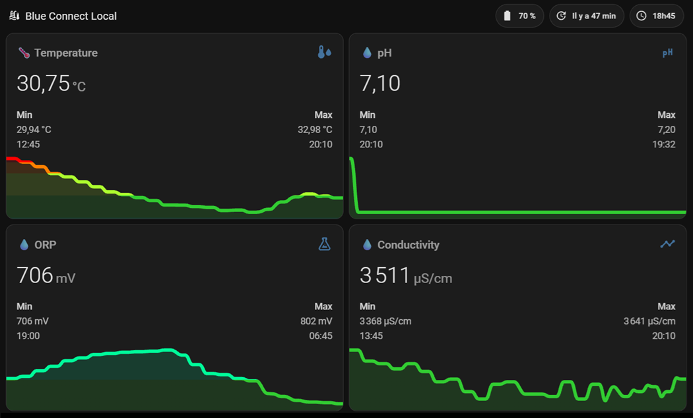
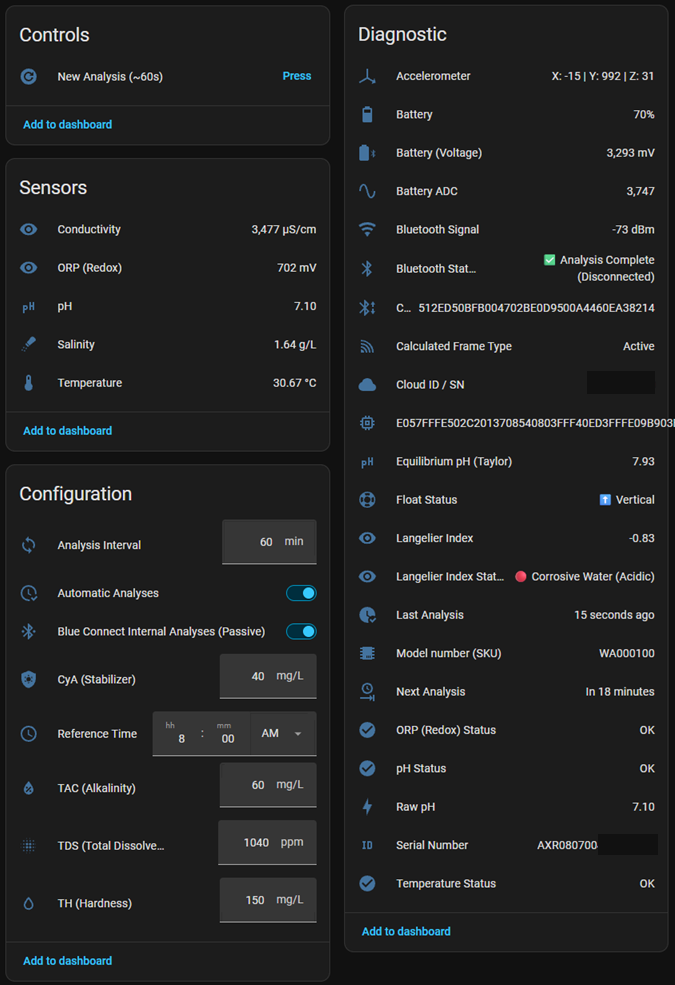

 

# Blue Connect Local pour Home Assistant 🐬

Si ce projet vous est utile, vous pouvez soutenir son développement 🙏

---

## ⚡ En résumé
- 🔌 Fonctionnement 100 % local via Bluetooth (BLE)
- 🏠 Compatible Home Assistant (sans cloud)
- 🌡️ Mesures : Température, pH, ORP Redox, Salinité, Conductivité, Batterie
- 🎯 Analyse Manuel : Possibilité de forcer une nouvelle analyse de l'eau à la demande, à distance
- ⚖️ Statut de Flottaison
- 🔋 Optimisé pour préserver la batterie
- ⚙️ Installation via HACS en 2 minutes

---

## 📸 Exemples dans Home Assistant

### 📊 Visualisation

  

  <em>📊 Vue d’ensemble des données de la piscine dans Home Assistant</em>

---

### 🔍 Détails techniques

  

  <em>🔍 Entités exposées par l’intégration & ⚙️ Options de Configuration avancées</em>

---

Une **intégration 100% locale pour Home Assistant** qui transforme votre analyseur Blue Connect en capteur Bluetooth Low Energy (BLE), afin de piloter et surveiller votre piscine sans aucune dépendance au Cloud. 🛡️

> ⚠️ **Avertissement** : Cette intégration interroge le Blue Connect directement en Bluetooth.

### 💡 Pourquoi cette intégration ?
Cette intégration libère votre Blue Connect du Cloud en exploitant directement son protocole BLE pour une gestion domotique sans compromis :

* **🔒 100 % local :** Fonctionne sans internet. Vos données transitent directement de la piscine à Home Assistant.
* **⏱️ Sans limite d'API :** Écoute passive des trames régulières et possibilité de forcer une mesure à la demande, sans aucune restriction.
* **🛡️ Pérennité :** Indépendance totale vis-à-vis des serveurs officiels, garantissant le fonctionnement de votre matériel sur le long terme.

**Blue Connect Local** est le fruit d'un travail de **Reverse Engineering** approfondi pour transformer votre analyseur en un véritable capteur industriel local, capable de communiquer directement avec votre instance Home Assistant.
Blue Connect Local permet de remplacer le cloud par une solution de **local control**, tout en offrant un système fiable de **pool monitoring** basé sur un **BLE sensor**.

---

### ✅ Compatibilité / Prérequis
* 🏷️ **Modèles supportés** : ZODIAC Blue Connect (Gold / Silver).
* 🏅 **Testé sur** : Validé sur le **ZODIAC Blue Connect Gold**.
* 🔑 **Code d'Accès (Optionnel)** : Le code d'accès à 9 caractères de votre appareil. S'il n'est pas obligatoire pour l'écoute passive, il est **indispensable** pour les analyses à la demande.
* 🛠️ **Matériel requis** : Adaptateur Bluetooth interne, clé USB Bluetooth ou **Bluetooth Proxy ESPHome** (Fortement recommandé, [installation facile ici](https://esphome.github.io/bluetooth-proxies/)).
* 📶 **Qualité du signal** : Un signal RSSI stable (idéalement **supérieur à -75 dBm**) est indispensable pour garantir la connexion au Blue Connect. Les tests montrent qu'un signal inférieur à -90 dBm entraîne des échecs de lecture fréquents.
* ⏱️ **Surveillance en temps réel** : Une entité `sensor.*_signal_bluetooth` exploite l'écoute passive de Home Assistant pour vous permettre de surveiller la force du signal en direct, le tout sans drainer la batterie du Blue Connect !

> ❌ **Non compatible** : Les versions Blueriiot ne sont pas supportées.

---

### ✨ Points forts
* 🏠 **100% Local (BLE)** : Aucune dépendance au Cloud, pas d'abonnement, pas de latence.
* 🌡️ **Remontée des capteurs bruts** : Température, pH, ORP (Redox), Salinité, Conductivité, Batterie (%).
* 🚀 **Analyse en temps réel** : Lancez une mesure manuelle quand vous le souhaitez.
* 🧪 **Intelligence Chimique Avancée** :
  * Calcul de l'**Indice de Langelier** (ISL) pour déterminer si l'eau est équilibrée, entartrante ou corrosive.
* 🟤 **Support Multi-Traitements** : Prise en charge du **Brome** (désactive automatiquement l'entité CyA, non pertinente pour ce traitement) et des piscines sans stabilisant (CYA = 0).
* ⚙️ **Configuration 100% UI** : Découverte automatique Bluetooth, calibrage des sondes et réglage des seuils d'alerte directement depuis l'interface Home Assistant (aucun YAML requis).
* 🔄 **Modes de Synchronisation** : Mode Passif (écoute silencieuse préservant la batterie) et Mode Actif (analyses Bluetooth à la demande via le code d'accès).
* 🌍 **Multi-langue** : Développé en Français 🇫🇷 et disponible en EN, ES, DE, IT, NL, PL, PT, PT-BR, SV, RU, ZH-HANS, ZH-HANT, CS, HU, EL, HR, DA, NB (Traduction via IA).
* 📡 Transforme votre Blue Connect en véritable **BLE sensor** pour Home Assistant

---

### 🚀 Installation

#### Via HACS (Recommandé)
Ce dépôt n'étant pas (encore) dans la liste officielle par défaut, vous devez l'ajouter en tant que dépôt personnalisé.

1. Ouvrez **HACS** dans votre Home Assistant.
2. Cliquez sur les 3 petits points en haut à droite et sélectionnez **Dépôts personnalisés**.
3. Dans **Dépôt**, collez l'URL : `https://github.com/Adrien40/ha-blue-connect-local`
4. Dans **Type**, choisissez **Intégration** puis cliquez sur **Ajouter**.
5. Une fois ajouté, une fenêtre apparaît : cliquez sur **Télécharger** (sélectionnez la dernière version).
6. **Redémarrez complètement Home Assistant**.
7. Allez dans **Paramètres** > **Appareils et Services** > **Ajouter une intégration** et cherchez "Blue Connect Local".

### Manuelle
Copiez le dossier `custom_components/blue_connect_local` dans le dossier `custom_components` de votre configuration Home Assistant, puis redémarrez.

---

### 📊 Capteurs et Contrôles disponibles
| Entité | Unité / Type | Description |
| :--- | :--- | :--- |
| 💧 **pH** | pH | pH calculé (Nernst + Compensation thermique). |
| ⚡ **Redox / ORP** | mV | Potentiel d'oxydoréduction. |
| 🌡️ **Température** | °C | Température précise de l'eau. |
| ⚖️ **Indice de Langelier** | ISL | Indicateur d'équilibre de l'eau (Corrosive, Équilibrée ou Entartrante). |
| 🎯 **pH d'Équilibre** | pH | Cible du pH idéal calculé selon la Balance de Taylor. |
| 🔋 **Batterie** | % et mV | Niveau de charge (%) et tension brute de la pile. |
| 📶 **Signal RSSI** | dBm | Force du signal Bluetooth reçu en temps réel. |
| 🔵 **État Bluetooth** | Statut | État détaillé de la connexion (Connecté, En veille, Erreur...). |
| ⏱️ **Prochaine Analyse** | Horodatage | Heure estimée de la prochaine relève de données. |
| 🚀 **Nouvelle Analyse** | Bouton | **Lancer une analyse instantanée (~60s).** |
| ⏸️ **Analyses Auto.** | Interrupteur | Activer/Désactiver la relève automatique (Mode Pause). |

> 🛠️ **Diagnostic** : L'intégration expose également des capteurs avancés (pH formule usine d'origine, trame hexadécimale brute complète, et statuts d'alertes binaires).

---

### 🧪 Expertise Chimique : Une analyse de niveau Professionnel

👉 Pas besoin de comprendre ces calculs : tout est automatisé dans Home Assistant.

🔬 Voir les détails scientifiques

#### Équilibre de l'eau : Indice de Saturation de Langelier & Balance de Taylor ⚖️
L'Indice de Saturation de Langelier (ISL) est le complément indispensable de la **Balance de Taylor**. Il permet de vérifier si votre eau est :
* **Corrosive (ISL < -0.3)** : L'eau attaque vos joints, liner et métaux.
* **Équilibrée (ISL entre -0.3 et +0.3)** : L'eau parfaite.
* **Entartrante (ISL > +0.3)** : Risque de dépôts calcaires.

Renseignez votre TAC, TH et TDS dans les options, et Home Assistant calculera votre équilibre en direct selon la température lue par le Blue Connect !

> **Diagnostic** : L'intégration expose également le pH brut (mV), le pH calculé par la formule d'usine, la trame hexadécimale complète et l'horodatage de la dernière mesure.

### 🎯 Note sur la précision des mesures
Les valeurs affichées dans Home Assistant peuvent différer légèrement de celles de l'application officielle Blue Connect.

Blue Connect Local permet une calibration "haute précision". Contrairement à l'application mobile qui utilise des valeurs fixes, notre intégration vous permet de saisir la valeur exacte de votre solution tampon (pH 7.02, 4.01, etc.) ajustée à la température lors de votre calibration. C'est cette rigueur scientifique qui peut créer un léger décalage, signe d'une mesure plus proche de la réalité de votre bassin. 🔬

---

## 🚀 Configuration
1. Allez dans **Paramètres** > **Appareils et services**.
2. L'intégration devrait détecter automatiquement votre Blue Connect si votre clé/antenne Bluetooth est à portée.
2. Cliquez sur **Ajouter une intégration** et recherchez **Blue Connect Local**.
3. Suivez les instructions à l'écran pour définir le type de traitement (Chlore, Brome) et le calibrage/décalage de vos sondes.

### ⚙️ Options, Calibrations et Alertes
Une fois l'appareil ajouté, vous pouvez cliquer sur **Configurer** ⚙️ pour :
* Ajuster les valeurs de vos solutions de calibration (pH 4, pH 7, Redox).
* Modifier les paramètres de votre eau (TAC, TH, TDS, Stabilisant) via le tableau de bord.
* Définir vos **seuils d'alerte personnalisés** (pH Min/Max, ORP Min/Max, etc.) pour piloter vos propres automatisations.

---

### 🐛 Dépannage

⚠️ Voir les problèmes fréquents

  
* **Erreurs Bluetooth fréquentes** : L'intégration gère automatiquement les tentatives de connexion. Si le capteur indique `Signal Perdu`, le Blue Connect est hors de portée. Rapprochez votre antenne ou [installez un Proxy Bluetooth ESPHome](https://esphome.github.io/bluetooth-proxies/) au plus près du bassin (nécessite juste un ESP32 (~10€) et un chargeur USB).

---

### 🤝 Contributions & Support
Pour tout bug ou demande d'amélioration, merci d'ouvrir une [Issue](https://github.com/Adrien40/ha-blue-connect-local/issues) sur ce dépôt.

### ⚠️ Avertissement (Disclaimer)
Cette intégration est un projet indépendant. Elle n'a aucun lien, de près ou de loin, avec l'entreprise Fluidra/Zodiac. L'utilisation de ce logiciel se fait sous votre propre responsabilité.

### ⚖️ Licence
Projet sous licence **GPLv3**. Indépendant de la société Fluidra. Utilisation sous votre entière responsabilité.

---

**Développé avec ❤️ par @Adrien40**

<!-- Keywords: Home Assistant custom integration, BLE sensor, pool monitoring, local control -->
